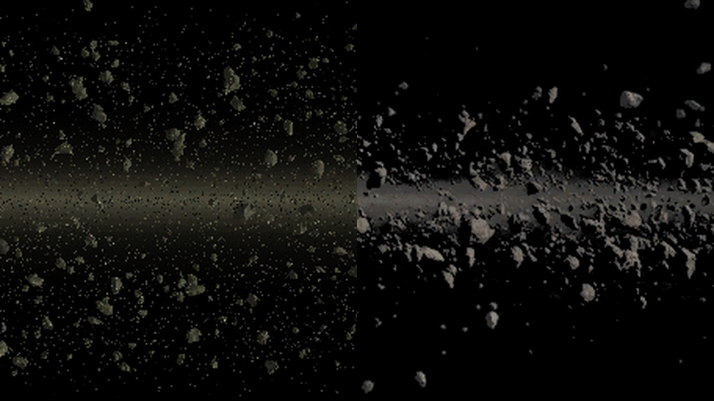

# HD Asteroid Fields

A texture mod for *Nexus: The Jupiter Incident*.

Replaces the seven background asteroid fields: the distant belts drawn behind every asteroid-field mission, in three layers at different depths. They are repainted to match the rock color of [HD Asteroids](https://steamcommunity.com/sharedfiles/filedetails/?id=3801582318), so the belts in the distance and the asteroids you fly past are the same material. Best used together with it.

The source images were generated with Nano Banana.

Original on the left, replacement on the right.

## Steam Workshop
[https://steamcommunity.com/sharedfiles/filedetails/?id=3802704750](https://steamcommunity.com/sharedfiles/filedetails/?id=3802704750)

## Manual Install (e.g. for GOG version)

Copy the repository contents into a new folder inside the game's `mods/` directory, then enable the mod in the game launcher.

## Licence

[CC0 1.0](LICENSE) — public domain. Reuse freely, commercially or otherwise, no attribution required. Contains no original game assets.
